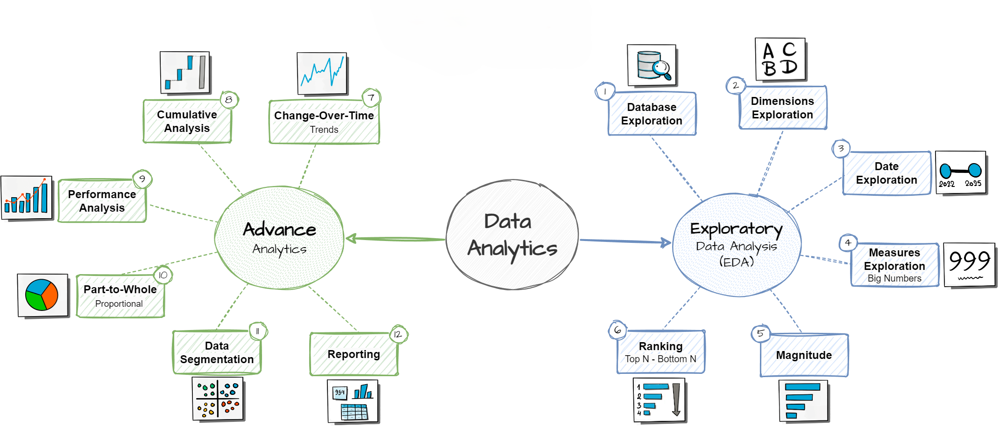

# 📊 SQL Data Analysis — Proyecto Completo


> Colección de scripts SQL (PostgreSQL / PLpgSQL) que aplica técnicas avanzadas de Análisis de Datos sobre un modelo de datos de ventas y clientes.


---

## 🎯 ¿Qué aprenderás con este proyecto?

Este repositorio es una **guía práctica de análisis de datos con SQL puro**. Si lo estudias y ejecutas, serás capaz de:

- Explorar y entender la estructura de cualquier base de datos relacional desde cero.
- Aplicar las técnicas analíticas más demandadas en el mundo real: rankings, acumulados, análisis temporal, segmentación y proporciones.
- Escribir consultas SQL avanzadas con funciones de ventana, CTEs y agrupaciones complejas.
- Construir informes consolidados de clientes y productos listos para negocio.

Es ideal como **proyecto de portfolio** para demostrar habilidades analíticas en entrevistas de trabajo, o como referencia reutilizable en el día a día como analista o profesional de BI.

---

## 📝 Descripción General

Los scripts cubren desde la exploración inicial de la base de datos hasta técnicas avanzadas como análisis acumulativos, segmentación de clientes, análisis de rendimiento y cálculo de proporciones. Cada script aborda un tema analítico concreto y está diseñado para ser **comprensible de forma independiente**, aunque juntos forman un flujo de análisis completo.

---

## 🏛️ Arquitectura del Proyecto

Este repositorio forma parte de un flujo completo **Data Engineering → Data Analysis**:

```
┌──────────────────────────────────────────────────────────────────┐
│               PROYECTO DE DATA ENGINEERING (origen)              │
│                                                                   │
│  Fuentes externas ──► 🥉 Bronze ──► 🥈 Silver ──► 🥇 Gold        │
│  (CRM, ERP, etc.)      (raw)         (limpia)      (analítico)   │
└──────────────────────────────────────────────────────────────────┘
                                                       │
                                                       ▼
┌──────────────────────────────────────────────────────────────────┐
│               ESTE REPOSITORIO (análisis sobre Gold)             │
│                                                                   │
│   scripts/ ──► Consultas analíticas sobre tablas dim_* y fact_*  │
└──────────────────────────────────────────────────────────────────┘
```

Los scripts de análisis trabajan directamente sobre la **capa Gold**, que contiene tablas dimensionales (`dim_*`) y de hechos (`fact_*`) ya limpias, estandarizadas e integradas.

---

## 🗂️ Estructura del Repositorio

```
sql-data-analysis-complete-project/
│
├── datasets/
│   └── csv-files/           # 17 archivos CSV exportados del Data Warehouse
│       ├── bronze_*.csv     # Capa Bronze: datos crudos de los sistemas fuente
│       ├── silver_*.csv     # Capa Silver: datos limpios y estandarizados
│       └── gold_*.csv       # Capa Gold: tablas dim_* y fact_* del modelo estrella
│
├── docs/                    # Diagramas del modelo de datos y documentación adicional
│
└── scripts/                 # Scripts SQL organizados por técnica analítica
```

### 📁 `datasets/`

Contiene los archivos CSV resultantes del Data Warehouse. Para los análisis se utilizan únicamente las vistas de la capa Gold:

| Vista | Descripción |
|-------|-------------|
| `gold.dim_customer` | Información de los clientes |
| `gold.dim_products` | Catálogo de artículos con categorías y precios |
| `gold.fact_sales` | Transacciones con fechas, cantidades e importes |

### 📁 `docs/`

Documentación de apoyo: diagramas del modelo de datos (ERD), descripción de los conjuntos de datos y guías de uso.

### 📁 `scripts/`

El núcleo del proyecto. Los scripts están organizados por categoría analítica y deben ejecutarse en orden numérico:

| Script | Descripción |
|--------|-------------|
| `01_database_exploration.sql` | Exploración inicial: tablas, columnas, tipos de datos, conteos de registros y valores únicos |
| `02_dimensions_exploration.sql` | Análisis de tablas de dimensiones: clientes, productos y territorios |
| `03_date_range_exploration.sql` | Exploración del rango temporal de los datos y detección de huecos en fechas |
| `04_measures_exploration.sql` | Cálculo de métricas clave: totales, promedios, mínimos y máximos |
| `05_magnitude_analysis.sql` | Análisis de magnitud: identificación de los valores más grandes y más pequeños |
| `06_ranking_analysis.sql` | Técnicas de ranking con `RANK()`, `DENSE_RANK()` y `ROW_NUMBER()` |
| `07_change_over_time.sql` | Análisis de cambios a lo largo del tiempo: tendencias mensuales, anuales y comparativas |
| `08_cumulative_analysis.sql` | Análisis acumulativos: totales acumulados, medias móviles y sumas rodantes |
| `09_performance_analysis.sql` | Comparación de resultados reales frente a objetivos o períodos anteriores |
| `10_part_to_whole.sql` | Análisis de proporciones: contribución de cada parte al total (%) |
| `11_data_segmentation.sql` | Segmentación de clientes y productos en grupos significativos |
| `12_customer_report.sql` | Informe consolidado de clientes con métricas de valor, recencia y frecuencia |
| `13_product_report.sql` | Informe consolidado de productos con análisis de ventas, márgenes y tendencias |

---

## 🔍 Técnicas Analíticas Aplicadas

### 1. 🗺️ Exploración de la Base de Datos
Antes de analizar, es necesario entender los datos. Estos scripts permiten inspeccionar la estructura del esquema, identificar tablas y relaciones, detectar valores nulos y comprender el rango temporal de los registros disponibles.

### 2. 📈 Cambios a lo Largo del Tiempo (*Change Over Time*)
Análisis de evolución temporal usando funciones de ventana y agrupaciones por fecha. Permite identificar tendencias, estacionalidades y variaciones interanuales.

```sql
-- Ventas totales por año y mes
SELECT
    DATE_TRUNC('month', order_date) AS mes,
    SUM(sales_amount)               AS ventas_totales
FROM gold.fact_sales
GROUP BY 1
ORDER BY 1;
```

**Ejemplo de resultado:**

| mes        | ventas_totales |
|------------|---------------|
| 2022-01-01 | 48,320.00     |
| 2022-02-01 | 52,180.00     |
| 2022-03-01 | 61,450.00     |

### 3. 📊 Análisis Acumulativos (*Cumulative Analysis*)
Cálculo de totales acumulados y medias móviles con `SUM() OVER` y `AVG() OVER`. Útil para visualizar el crecimiento progresivo de una métrica.

```sql
-- Total acumulado de ventas
SELECT
    order_date,
    sales_amount,
    SUM(sales_amount) OVER (ORDER BY order_date) AS ventas_acumuladas
FROM gold.fact_sales;
```

### 4. 🏆 Análisis de Rendimiento (*Performance Analysis*)
Compara el rendimiento actual frente a un período anterior usando `LAG()`. Permite detectar de un vistazo si el negocio crece o retrocede.

```sql
-- Crecimiento respecto al año anterior
SELECT
    anio,
    ventas,
    LAG(ventas) OVER (ORDER BY anio)          AS ventas_anio_anterior,
    ventas - LAG(ventas) OVER (ORDER BY anio) AS diferencia
FROM gold.fact_sales;
```

### 5. 🧩 Segmentación de Datos (*Data Segmentation*)
Agrupa clientes o productos en segmentos según criterios cuantitativos usando `CASE WHEN`, `NTILE()` o rangos personalizados.

```sql
-- Segmentación de clientes por gasto total
SELECT
    customer_key,
    total_spent,
    CASE
        WHEN total_spent >= 10000 THEN 'VIP'
        WHEN total_spent >= 3000  THEN 'Regular'
        ELSE 'Ocasional'
    END AS segmento
FROM gold.dim_customers;
```

**Ejemplo de resultado:**

| customer_key | total_spent | segmento  |
|-------------|-------------|-----------|
| C-0041       | 15,200.00   | VIP       |
| C-0112       | 4,850.00    | Regular   |
| C-0237       | 980.00      | Ocasional |

### 6. 🍰 Análisis de Proporciones (*Part-to-Whole*)
Calcula el porcentaje que representa cada categoría sobre el total global. Fundamental para entender la distribución del negocio y detectar concentraciones de riesgo.

```sql
-- % de ventas por categoría de producto
SELECT
    category,
    SUM(sales_amount) AS ventas,
    ROUND(
        100.0 * SUM(sales_amount) / SUM(SUM(sales_amount)) OVER (),
    2) AS porcentaje
FROM fact_sales
JOIN gold.dim_products USING (product_key)
GROUP BY category;
```

### 7. 📋 Informes Consolidados (*Reports*)
Scripts que combinan múltiples técnicas para generar vistas analíticas completas. Incluyen métricas de **Recencia** (última compra), **Frecuencia** (número de pedidos) y **Valor monetario** (gasto total acumulado).

---

## ⚙️ Requisitos y Configuración

### Prerrequisitos

- **PostgreSQL** versión 12 o superior.
- Cliente SQL: [pgAdmin](https://www.pgadmin.org/), [DBeaver](https://dbeaver.io/), o cualquier cliente compatible.

### Pasos para Ejecutar el Proyecto

**1. Clona el repositorio:**
```bash
git clone https://github.com/aliciagilmatute/sql-data-analysis-complete-project.git
cd sql-data-analysis-complete-project
```

**2. Crea la base de datos:**
```sql
CREATE DATABASE sql_analytics_db;
```

**3. Carga los datos de la capa Gold:**
```bash
-- Ejecuta en orden los archivos de datasets/csv-files/gold_*.csv
-- o importa directamente desde tu cliente SQL (pgAdmin / DBeaver)
```

> 💡 Los scripts de análisis solo necesitan las tablas de la capa Gold (`gold.dim_customer`, `gold.dim_products`, `gold.fact_sales`). Si ya tienes un Data Warehouse propio, puedes adaptar los scripts a tu esquema.

**4. Ejecuta los scripts de análisis:**

Abre los archivos de la carpeta `scripts/` y ejecútalos en orden numérico, comenzando por `01_database_exploration.sql`.

---

## 🧰 Tecnologías Utilizadas

| Tecnología | Uso |
|-----------|-----|
| **PostgreSQL** | Motor de base de datos relacional |
| **PLpgSQL** | Lenguaje procedural para scripts avanzados |
| **pgAdmin / DBeaver** | Clientes SQL para ejecutar y visualizar resultados |
| **SQL Window Functions** | `RANK()`, `LAG()`, `SUM() OVER()`, `AVG() OVER()` |
| **CTEs** | Consultas estructuradas con `WITH` para mayor legibilidad |

---

## 📚 Conceptos SQL Demostrados

A lo largo del proyecto se aplican los siguientes conceptos:

- **Funciones de ventana:** `ROW_NUMBER()`, `RANK()`, `DENSE_RANK()`, `LAG()`, `LEAD()`, `SUM() OVER()`, `AVG() OVER()`
- **CTEs (Common Table Expressions):** uso de `WITH` para estructurar consultas complejas en pasos legibles
- **Agrupaciones avanzadas:** `GROUP BY`, `ROLLUP`, `CUBE`
- **Funciones de fecha:** `DATE_TRUNC()`, `EXTRACT()`, `AGE()`, `DATE_PART()`
- **Funciones condicionales:** `CASE WHEN`, `COALESCE()`, `NULLIF()`
- **Subqueries y JOINs** para combinar múltiples tablas y fuentes de datos

---

## 📌 Casos de Uso

Este proyecto es ideal para:

- 👩‍💻 **Analistas de datos** que quieren practicar SQL orientado al análisis de negocio.
- 📊 **Profesionales de BI** que necesitan plantillas de consultas reutilizables.
- 🎓 **Estudiantes** que buscan ejemplos reales de técnicas analíticas en SQL.
- 🗂️ **Portfolio profesional** para demostrar habilidades en entrevistas de trabajo.

---

## 🔗 Proyectos Relacionados

Este repositorio es la segunda parte de un flujo completo de datos. El origen de los datasets utilizados aquí es el siguiente proyecto de Data Engineering:

> 📦 **[SQL Data Warehouse Project](https://github.com/aliciagilmatute/sql_data_warehouse_project)** — Construcción de un Data Warehouse desde fuentes brutas hasta la capa Gold, con arquitectura Medallion (Bronze → Silver → Gold).

---

## 👤 Autora

**Alicia Gil Matute**  
[](https://github.com/aliciagilmatute)

---

## 📄 Licencia

Este proyecto está disponible con fines educativos y de práctica.

---

*¿Tienes sugerencias o mejoras? ¡Las contribuciones son bienvenidas! Abre un issue o un pull request.*
